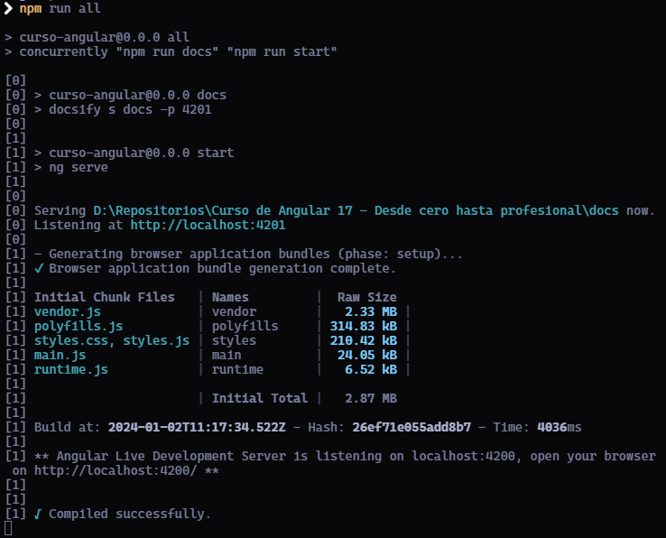
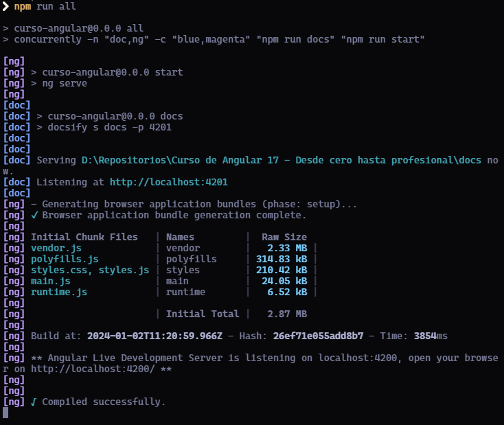

# Curso Angular 17: De principiante a experto

Esta documentación resumirá todos los conocimientos que tengo ya de [Angular](https://angular.dev), más los que pueda ir obteniendo en el curso.
(`<a href="">` Ir a proyecto ANGULAR `</a>`)

Así como los conocimientos que vaya consiguiendo al realizar la documentación. ([Docsify](https://docsify.js.org/#/))

## Docsify

**Instalación** de Docsify

```bash
npm i docsify-cli -g
```

**Inicialización** de un proyecto con Docsify

```bash
docsify serve docs
```

Siendo **docs** el nombre de la carpeta contenedora del proyecto, que, lo más común es que sea la carpeta de la documentación (/docs).

Esta orden genera 3 ficheros en el directorio ./docs:

* **index.html** como el fichero general html, donde se añadirán los plugins y configuraciones de Docsify.
* **README.md** como la home page de nuestra documentación.
* **.nojekyll** prevents GitHub Pages from ignoring files that begin with an underscore
  You can easily update the documentation in ./docs/README.md, of course you can add more pages.

## Ejecución en Paralelo

**Instalación** de Concurrently

```bash
npm i concurrently -g
```

Si ejecutamos la orden `concurrently \"npm run docs\" \"npm run start\"` deberíamos ver la ejecución de ambas órdenes de forma paralela. Las podremos ubicar de acuerdo a los números de procesos que encontraremos al principio de la línea entre corchetes.



Para una mejor compresión de los procesos, podemos utilizar las configuraciones:

* **-n** para que en vez de que aparezca el número de proceso, aparezca un nombre.
* **-c** para añadirle un color al

```bash
concurrently -n \"doc,ng\" -c \"blue,magenta\" \"npm run docs\" \"npm run start\"
```



## Deploy to Vercel
```bash
npm i vercel -g
```
