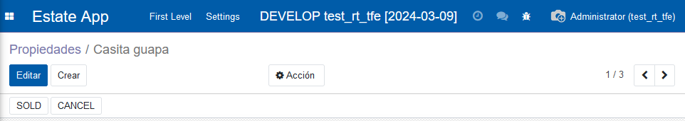
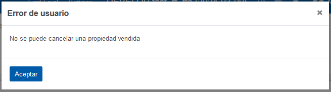
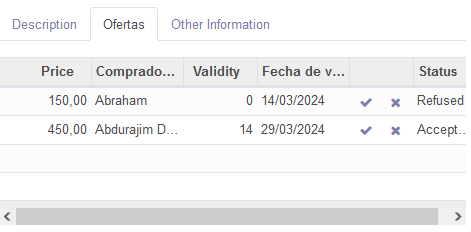

# Capítulo 10 - ¿Preparado para algo de Acción?

[https://www.odoo.com/capitulo10](https://www.odoo.com/documentation/14.0/developer/tutorials/getting_started/10_actions.html)

En este capítulo se han visto la ubicación de compoonentes en una **cabecera**, las **acciones de botones** dentro de un modelo, el _lanzamiento de errores_ con **UserError**, y la capacidad de añadir **iconos** a los botones.

## Cabecera

Funciona igual que las cabeceras de html, se ubican dentro del apartado pertinente (_tree o form_), antes del _sheet_, y dentro (asumo) puede llevar cualquier cosa, no solo botones.

```xml
<form string="Test">
    <header>
        <button name="action_sold" type="object" string="SOLD"/>
        <button name="action_cancel" type="object" string="CANCEL"/>
    </header>
    <sheet>
        <field name='campo'/>
    </sheet>
</form>
```



## Acción en botones

Funciona de forma parecida a web, lo que en web se usa como un `onClick="moduleAction()`, aqui funciona como `name='module_action'` que tiene que estar ubicado en el modelo pertinente.

```xml
<header>
    <button name="action_sold" type="object" string="SOLD"/>
    <button name="action_cancel" type="object" string="CANCEL"/>
</header>

```

```python
def action_cancel(self):
    self.state ="cancelado"

def action_sold(self):
    self.state ="vendido"
```

## Lanzamiento de errores con UserError

Asumo que habrá millones de tipos de errores, en este caso, se lanza un error de usuario.

```python
from odoo.exceptions import UserError

def action_cancel(self):
    if self.state =='vendido':
        raise UserError('No se puede cancelar una propiedad vendida')
    self.state ="cancelado"

def action_sold(self):
    if self.state =='cancelado':
        raise UserError('No se puede vender una propiedad cancelada')
    self.state ="vendido"
```



## Iconos

La forma de añadir iconos a un botón sería utilizando la etiqueta `icon="icon_name"` dentro de `<button />`

```xml
<button name="action_accept" type="object" icon="fa-check"/>
<button name="action_refuse" type="object" icon="fa-times"/>
```


