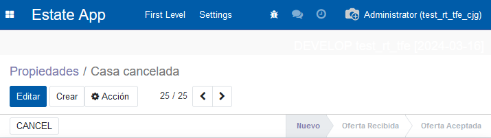
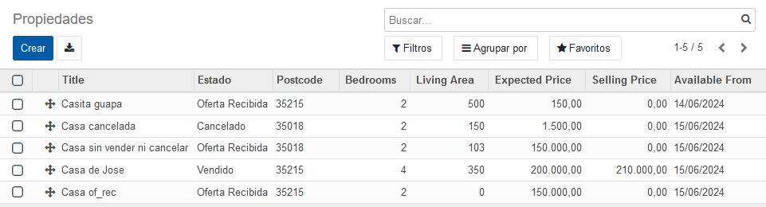

# Capítulo 12 - Agrega las "¿¿chispas??"
(Soy el Cristóbal del futuro advirtiendo que esta parte da asco. Respira, **piensa en gatitos** y sigue adelante)

[https://www.odoo.com/capitulo12](https://www.odoo.com/documentation/14.0/developer/tutorials/getting_started/12_sprinkles.html)

Este capítulo es tan confuso como atractivo. Se ve cómo "crear un formulario con información que pertenece a un modelo externo", **statusbar** como widget, el **orden** por defecto en la lista de un modelo, **handler** comom widget para ordenar dinámicamente los campos y más cosas.

## Crear un Tree con los datos de un modelo externo

(Expongo el ejemplo en la parte de abajo) Creo que el ejemplo que se pone en la [página](https://www-odoo-com.translate.goog/documentation/14.0/developer/tutorials/getting_started/12_sprinkles.html?_x_tr_sl=auto&_x_tr_tl=en&_x_tr_hl=en#tutorials-getting-started-12-sprinkles) es bastante _accurate_:

Queremos obtener las variables de **test_model_line** desde **test_model**, para ello, creamos una variable (`model_id`) que una `test.model.line`, con `test_model`.

> Many to One porque muchas propiedades a un tipo.

```python
# test_model_line.py
from odoo import fields, models

class TestModelLine(models.models):
    _name ="test.model.line"
    _description ="descripcion1"

    model_id = fields.Many2one('test.model')
    name = fields.char()
    field_1 = fields.Char()
    field_2 = fields.Char()
    field_3 = fields.Char()
```

En **test_model**, queremos mostrar ciertos datos del modelo **test_model_line**, para ello, creamos la variable `line_ids`, con un campo `uno a muchos` (Por lo contrario del caso anterior).

```python
# test_model.py
from odoo import fields, models

class TestModel(models.models):
    _name ="test.model"
    _description ="descripcion"

    name = fields.char()
    # queremos hacer referencia al campo model_id de test_model_line
    line_ids = fields.One2many('test.model.line','model_id')
```

En nuestra vista, tendremos x campos, y el **_field_** que queramos rellenar contendrá `name=line_ids`.

Dentro crearemos un _tree_/lista y en su interior existirán las variables que tenga el modelo. En este caso, podríamos acceder desde `line_ids`, al los campos `field_1`, `field_2`, `field_3` y `name`

```xml
<!-- test_model.xml -->
    <form>
    <field name="description"/>
    <field name="line_ids">
        <tree>
            <field name="field_1"/>
            <field name="field_2"/>
        </tree>
    </field>
</form>
```

## Widgets

### Statusbar

En las aplicaciones las transiciones visuales entre pasos ayudan. En odoo esto se hace con el `widget="statusbar"`.

En el caso del ejercicio, la transición sería nuevo > oferta recibida > oferta aceptada > vendido.

Esto se conseguiría con:

```xml
<header>
    <field name="state" widget="statusbar" statusbar_visible="nuevo,of_rec,of_ace,vendido"/>
</header>
```

```python
STATE_SELECTION =[
    ("nuevo","Nuevo"),
    ("of_rec","Oferta Recibida"),
    ("of_ace","Oferta Aceptada"),
    ("vendido","Vendido"),
    ("cancelado","Cancelado")
]

state = fields.Selection(
    selection=STATE_SELECTION,
    copy=False,
    default="nuevo",
    string="Estado"
)
```

Necesitamos colocar `statusbar_visible="..."` para decir qué **estados se muestran**, ya que, por ejemplo, en este caso, no mostramos cancelado por defecto, simplemente si el state es canceled **aparece** de forma puntual en ese caso.



### Handle

En caso de querer modificar de forma manual el orden de las listas podemos utilizar `widget="handle"`

```xml
<tree string="datos">
   <field name="sequence" widget="handle"/>
   <field name="name"/>
   <field name="state"/>
   <field name="postcode"/>
   <field name="bedrooms"/>
   <field name="living_area"/>
   <field name="expected_price"/>
   <field name="selling_price"/>
   <field name="date_availability"/>
</tree>

```



## Orden de listas

Podemos asignar un orden por defecto a los _tree_/listas de cada modelo.

Por ejemplo:
<!-- tabs:start -->
<!-- tab:estate.property.py -->

```python
class EstateProperty(models.Model):
    _name ='estate.property'
    _description ="Propiedad Inmobiliaria"
    _id ="id desc"
```
<!-- tab:estate.property.offer.py -->
```python
class EstatePropertyOffer(models.Model):
    _name ='estate.property.offer'
    _description ="Ofertas de las propiedades de bienes raíces"
    _id ="price desc"
```
<!-- tabs:end -->

## Atributos y opciones

He estado esperando desde que empezó la UI a esto ejejej

### Colorear tags

Capacidad para mostrar o no ciertos elementos según atributos u opciones.  
Si queremos **_colorear nuestros tags_**, tendremos que añadir la variable con el nombre en el modelo del `tag`, y colocar el atributo `options` dentro del field de `tags_id`.

```python
#estate_property_tag.py
class EstatePropertyTag(models.Model):
    _name ='estate.property.tag'
    _description ="Tags de Propiedad"
    _id ="name"

    name = fields.Char(required=True)
    color = fields.Integer()
```

```xml
<!-- estate_menu.xml -->
<fiel dname="tags_id" widget="many2many_tags" options="{'color_field': 'color', 'no_create_edit': True}"/>
```

### Mostrar u ocultar campos en funcion de...

#### En función de estados

Si tenemos un conjunto de estados, como en este caso, que tenemos:

```python
STATE_SELECTION =[
        ("nuevo","Nuevo"),
        ("of_rec","Oferta Recibida"),
        ("of_ace","Oferta Aceptada"),
        ("vendido","Vendido"),
        ("cancelado","Cancelado")
]
```

Usaremos el atributo `states=` donde colocaremos los estados donde se tiene que mostrar el componente.

```xml
<button name="action_cancel" type="object" string="CANCEL" states="nuevo,of_rec,of_ace"/>
```

#### Funciones booleanas

Si queremos hacer uso de una función _booleana_ para comprobar si se tiene que mostrar ese campo o no, se usa `attrs=` con el texto `{'invisible': [('var1', '=', 'var2'), ('var3', '!=', ''var4')]}`

```xml
<field name="garden_area" attrs="{'invisible': [('garden', '=', False)]}"/>
<field name="garden_orientation" attrs="{'invisible': [('garden', '=', False)]}"/>
```

Se puede usar el atributo `invisible=1` para hacer que un campo no se muestre.

```xml
<field name="is_partner" invisible="1"/>
```

#### Uso de python

Al estar usando python, podemos utilizar algunas de las ventajas que nos aporta este lenguaje tal que:

```xml
<field name="offers_ids" attrs="{'readonly':[('state','in',('vendido', 'cancelado', 'of_ace'))]}"/>
```

## Listas

Si le colocamos el atributo `editable='True'` podremos modificar las variables desde la vista de Lista/_Tree_.

```xml
<record id="estate_property_tree_view"model="ir.ui.view">
   <field name="name">Estate View</field>
   <field name="model">estate.property</field>
   <field name="arch"type="xml">
       <tree string="datos" editable="True">
           <field name="sequence" widget="handle"/>
           <field name="name"/>
           <field name="tags_id" widget="many2many_tags" options="{'color_field': 'color', 'no_create_edit': True}"/>
        </tree>
   </field>
</record>

```

## Mostrar datos de una vista en otra

**Da asco**, voy a intentar resumirlo lo máximo posible, teniendo en cuenta el ejercicio:
<!-- tabs:start -->
<!-- tab:estate_property_offer.py -->
```python
# Se añade la variable que hará de puente con el tipo de propiedad
property_type_id = fields.Many2one('estate.property.type', store=True, string="Tipo de Propiedad")
```

<!-- tab:estate_property_type.py -->
```python
# Variable que hara de puente con las ofertas
offers_ids = fields.One2many('estate.property.offer', 'property_type_id', string="Ofertas")
# Variable que será computada en función del nº de ofertas
offers_count = fields.Integer(compute='_compute_offers_count', string="Número de ofertas")

@api.depends('offers_ids')
def _compute_offers_count(self):
    for record in self:
        record.offers_count = len(self.offers_ids)
```

<!-- tab:estate_type_menu.xml -->
```xml
<record id="estate_property_offer_action" model="ir.actions.act_window">
    <field name="name">Ofrecimientos</field>
    <field name="res_model">estate.property.offer</field>
    <field name="view_mode">tree</field>
    <!--
         Se buscan los elementos de offers donde su id sea igual que la id del
          elemento que se ha pulsado 
    -->
    <field name="domain">[('property_type_id', '=', active_id)]</field>
</record>

<button position="after" type="action" name="%(estate_property_offer_action)d"
        class="oe_stat_button">
    <field string="Offers" name="offers_count" widget="statinfo"/>
</button>
```
<!-- tabs:end -->

