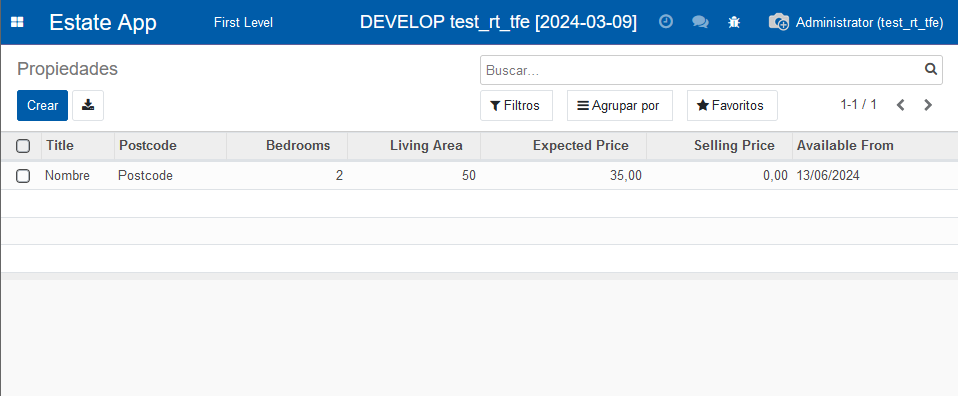
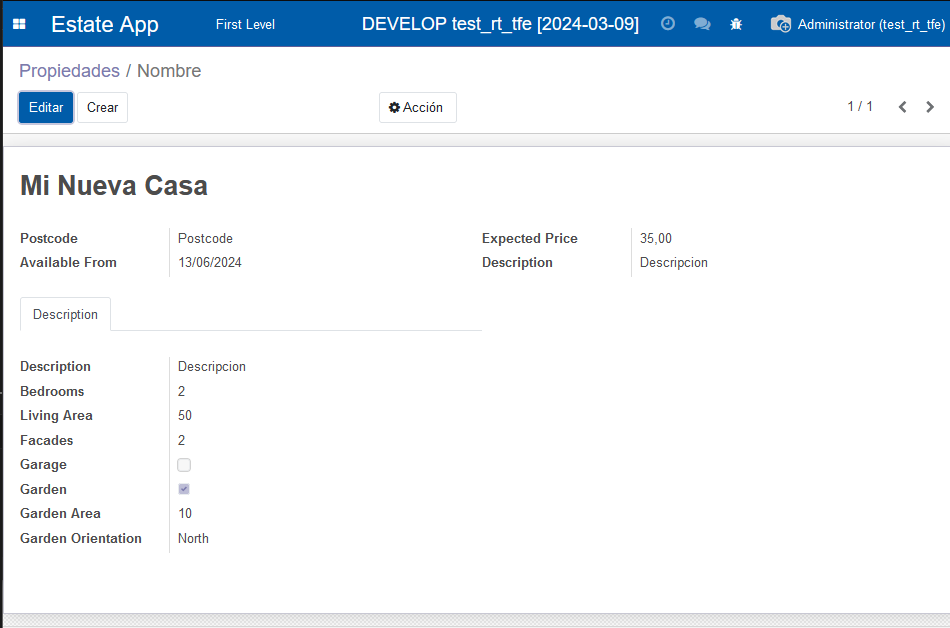
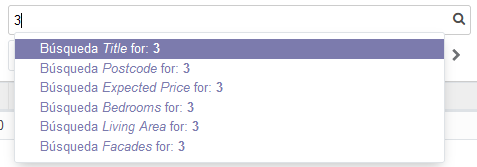
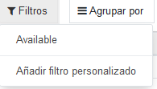
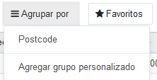

# Capítulo 7 - Vista básicas (creacion de vistas)

[https://www.odoo.com/capitulo7](https://www.odoo.com/documentation/14.0/developer/tutorials/getting_started/07_basicviews.html)

Para crear una vista, tendremos que crear otro record, que nos aporte la vista, este tendran un nombre y el modelo que querramos observar:

```python
<record id="estate_property_tree_view" model="ir.ui.view">
    <field name="name">Estate View</field>
    <field name="model">estate.property</field>
</record>
```

## Listas/Trees

Especifica los componentes que se encuentran en la **vista de tree**.
¿Qué significa? Según accedemos a la visión general del atributo, podemos ver que solo nos muestra el nombre, por lo que, **modificando la tree view**, podremos ver, esta vista de listas, **las columnas** que nosotros queramos. No es necesario poner todos los atributos del modelo, solo los que necesites.

Pone la siguiente advertencia, pero como soy super listo, ni se me ocurrió la de copiar y pegar, pero de aqui en adelante sí, jeje.

> **Advertencia**
> Probablemente utilizará algo de copiar y pegar en este capítulo, por lo tanto, asegúrese siempre de que el **id** siga siendo único para cada vista.

> Defina una vista de lista para el modelo `estate.property` en el archivo XML apropiado. Consulte el Objetivo de esta sección para ver los campos que se mostrarán.
> **Consejos:**
> No agregue el atributo `editable="bottom"` que puede encontrar en el ejemplo anterior. Volveremos a ello más tarde.
> Es posible que sea necesario adaptar algunas etiquetas de campo para que coincidan con la referencia.

```xml
<field name="arch" type="xml">
    <tree string="datos">
        <field name="name"/>
        <field name="postcode"/>
        <field name="bedrooms"/>
        <field name="living_area"/>
        <field name="expected_price"/>
        <field name="selling_price"/>
        <field name="date_availability"/>
    </tree>
</field>
```



## Form View

Especifica los datos que se ven a la hora de tener un elemento en concreto.  
¿Qué significa? Cuando clicamos uno de los elementos de la lista (tree), nos llevará a esta vista. He escuchado que se llama "**Vista de producto**" o "**Vista individual**"

Form > Sheet

- **group** se usa para agrupar un conjunto de campos. Genera un grupo tal que:

```html
<b>tag</b><span>tag_value</span>
```

- **notebook** se usa para tener distintas pestañas, asumo que es bastante intuitivo verlo en el caso de tener un excesivo número de datos y sea incómodo tener todo en 1 sola página.
- **page** se usa como separación entre pestañas. El atributo **string** proporcionará el nombre que se ve en la pestaña.

```xml
<notebook>
    <page string="Description">
        <group>
            <field name="description"/>
            <field name="bedrooms"/>
        </group>
    </page>
</notebook>
```

> En el ejercicio te piden que lo dejes como en la foto de los objetivos, es aproximadamente asi

```xml
<record id="estate_property_form_view" model="ir.ui.view">
        <field name="name">Form View</field>
        <field name="model">estate.property</field>
        <field name="arch" type="xml">
            <form string="Test">
                <sheet>
                    <group>
                        <group>
                            <field name="postcode"/>
                            <field name="date_availability"/>
                        </group>
                        <group>
                            <field name="expected_price"/>
                            <field name="selling_price"/>
                        </group>
                        <notebook>
                            <page string="Description">
                                <group>
                                    <field name="description"/>
                                    <field name="bedrooms"/>
                                    <field name="living_area"/>
                                    <field name="facades"/>
                                    <field name="garage"/>
                                    <field name="garden"/>
                                    <field name="garden_area"/>
                                    <field name="garden_orientation"/>
                                </group>
                            </page>
                        </notebook>
                    </group>
                </sheet>
            </form>
        </field>
    </record>
```



## Search View

Nos aporta cierta información, filtros y agrupaciones dentro de la vista de Lista (Tree).

Hay (según se ve en el tutorial), 3 tipos de búsquedas:

- **Campos** por los que buscar:

```xml
<field name="name"/>
```

- **Campos** por los que agrupar:

```xml
<group expand="1" string="Group by...">
    <filter name="postcode" string="Postcode"
            context="{'group_by' : 'postcode'}"/>
</group>
```

- **Filtros** por los que buscar:

```xml
<filter name="Available"
    domain="['|', ('active', '=', True), ('active', '=', False)]"/>
```

> El **ejercicio** te pide recrear las fotos que ponen, en esencia, es este código:

```xml
<record id="estate_property_search_view" model="ir.ui.view">
    <field name="name">Property state Search View</field>
    <field name="model">estate.property</field>
    <field name="arch" type="xml">
        <search string="estate_property_search">
            <field name="name"/>
            <field name="postcode"/>
            <field name="expected_price"/>
            <field name="bedrooms"/>
            <field name="living_area"/>
            <field name="facades"/>
            <group expand="1" string="Group by...">
                <filter name="postcode" string="Postcode"
                            context="{'group_by' : 'postcode'}"/>
            </group>
            <field name="active"/>
            <filter name="Available"
                        domain="['|', ('active', '=', True), ('active', '=', False)]"/>
        </search>
    </field>
</record>
```


Buscar por campo  
  
Filtros  
  
Agrupar por campo  
  
