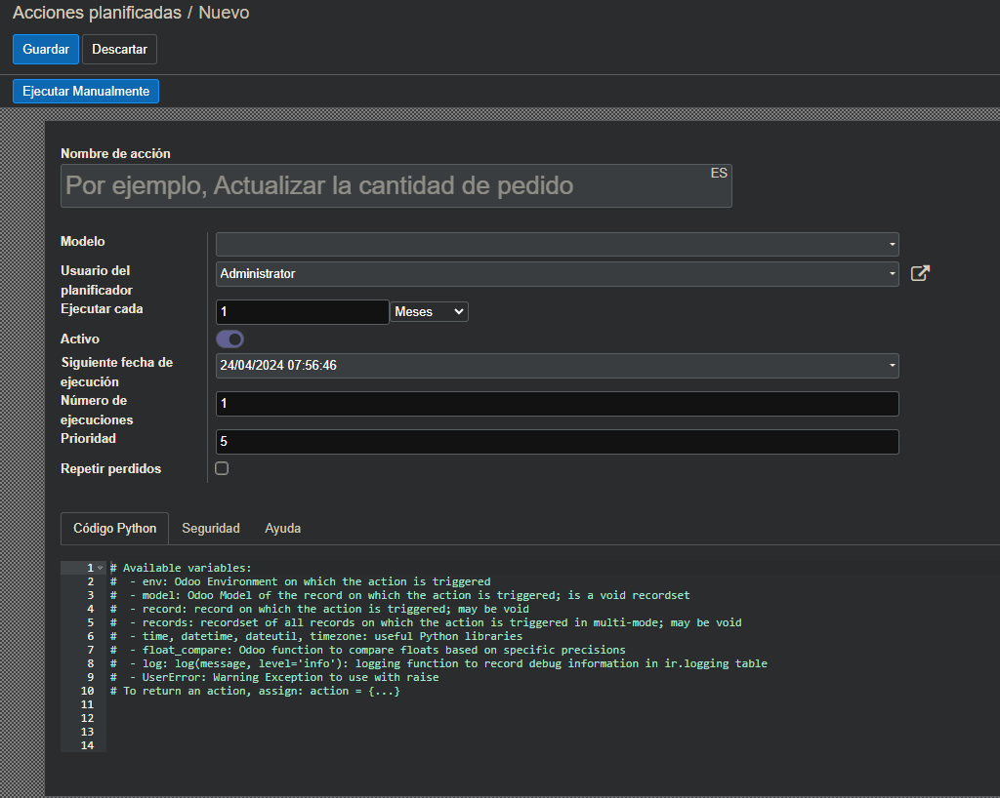

# Cron

Hay 2 formas (que yo sepa) de crear un cron en Odoo:

## De forma manual
Podremos ver la lista de crons y editarlos.
Para ello, accedemos a Ajustes (Con modo debugger/Con el mono) > Técnico > Automatización > Acciones planificadas.
Aqui dentro tendremos todos los Cron creados y podremos crear uno nuevo.

Podremos añadir: un 
* Un **Nombre** al cron
* El **modelo** al que afectará/usará
* El usuario que lo planifica
* Cada **cuanto tiempo** se ejecutará,
* Si el cron está **activo o no**  
* El número de veces que se ejecutará
* La prioridad con la que se ejecutará
* Y el **código** que se ejecutará  




Hay que tener en cuenta que si un Cron se crea de esta forma, no tendrá un ID externo al que poder referenciar en el código. Esto puede ser importante para ciertos momentos o funcionalidades.

## Por código
Para crear un cron por código, deberemos hacerlo en un fichero XML, en la carpeta `data` de nuestro módulo.
Este tendrá los mismos datos que el cron creado de forma manual, pero además, podremos añadir un ID al cron, para poder referenciarlo en el código.
```xml
<?xml version="1.0" encoding="utf-8"?>
<odoo>
    <data noupdate="1">
        <!-- ID al que se puede hacer referencia en el código -->
        <record forcecreate="1" id="infoboxer_api_kpi_cron_task" model="ir.cron">
        <!-- Nombre del cron para encontrarlo en Ajustes > Técnico > Automatización > Acciones planificadas -->
            <field name="name">infoboxer_kpi_api_cron_task</field>
        <!-- El modelo al que hace referencia/usará -->
            <field name="model_id" ref="infoboxer_api.model_infoboxer_api_server"/>
        <!-- ¿Decimos que lo siguiente será código? -->
            <field name="state">code</field>
        <!-- La función que queremos que se ejecute -->
            <field name="code">model.get_ikeafood_v2()</field>
        <!-- Cada cuanto se ejecutará (Número) -->
            <field name="interval_number">1</field>
        <!-- Cada cuanto se ejecutará (Tiempo) -->
            <field name="interval_type">hours</field>
        <!-- Número de veces que se ejecutará -->
            <field name="numbercall">-1</field>
        <!-- No sé¿? -->
            <field name="doall" eval="False"/>
        <!-- Si está activo o no -->
            <field name="active" eval="False"/>
        <!-- La próxima vez que se ejecute este cron -->
            <field name="nextcall" eval="time.strftime('%Y-%m-%d') + ' 02:00:00'"/>
        <!-- La prioridad -->
            <field name="priority">30</field>
        </record>
    </data>
</odoo>
```

D