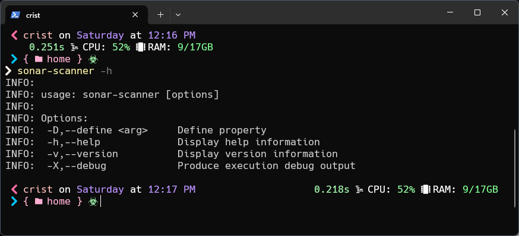

# SonarLint

Sonarlint es una extensión de [Visual Studio Code](https://marketplace.visualstudio.com/items?itemName=SonarSource), que nos aporta, como cualquier otro Lintern, una ayuda visual de posibles fallos en nuestro código.
```
Nombre: SonarLint
ID: SonarSource.sonarlint-vscode
Descripción: Linter to detect & fix coding issues locally in JS/TS, Python, PHP, Java, C, C++, C#, Go, IaC. Use with SonarQube & SonarCloud for optimal team performance.
Versión: 4.2.2
Editor: SonarSource
Vínculo de VS Marketplace: https://marketplace.visualstudio.com/items?itemName=SonarSource.sonarlint-vscode
```

# SonarQube
Si tienes algun problema con la instalación, puedes acceder directamente a la página de [SonarQube](https://n-saikiran.gitbook.io/sonarqube/installation-of-sonarqube).

## Instalación


Primero tendremos que descargar los 2 zips útiles para nosotros, que son: 
* El que contiene el servidor: [SonarSource](https://www.sonarsource.com/products/sonarqube/downloads/success-download-community-edition/)
* El que contiene el CLI de sonar-scanner: [SonarSource](https://docs.sonarsource.com/sonarqube/latest/analyzing-source-code/scanners/sonarscanner/)

### Windows
Tenemos la carpeta servidor en Descargas, la ubicamos en un sitio donde podamos tener fija esa carpeta. Por ejemplo, Documentos, o incluso, añadirla a ProgramFiles.  
Tendremos 2 carpetas, la del servidor, que tendremos que abrir para inicarlo, y el CLI, que añadiremos al *PATH* de windows para poder utilizarlo:

#### Servidor
Accederemos al directorio de windows dentro de bin:
```shell
cd ./sonarqube/bin/windows-x86-64
```

Para mayor comodidad para ejecutar el servidor, podemos dar click derecho al fichero StartSonar.bat > Send To > Desktop, y así tendremos un acceso directo al fichero en nuestro escritorio.  
Para ejecutar el servidor simplemente tendremos que ejecutar el fichero (doble click sobre el fichero).   
Se abrirá una terminal de windows y empezará a ejecutarse los comandos necesarios. 
Nosotros iremos a un navegador y accederemos a [http://localhost:9000/](http://localhost:9000/), si no da error, llegará un momento en el que se abra el servidor.

#### CLI
Accederemos al directorio de bin dentro de sonar-scanner.
Tendremos que añadir la ubicación de bin dentro del PATH de windows, para ello, haremos click derecho sobre cualquiera de los ficheros > propiedades y copiamos la localización completa del fichero.
A continuación, clicamos la tecla de Windows, escribimos *Variables de entorno* (*Environments variables* en inglés).  
Clicamos en *Path* > Edit... > New, y pegamos la localización del fichero.

Para confirmar que está bien, podemos abrir una terminal y escribir:
```shell
sonar-scanner -h
```



A continuación, tendremos que agregar un fichero de configuración para poder utilizar el escáner.
El fichero, para una correcta nomenclatura, debería tener *sonar* o *sonarqube*, seguido de *.properties* > ```sonar.properties``` o ```sonarqube.properties```

Los atributos necesarios para el correcto funcionamiento serían:
* **host**, para poner la dirección a la que se redirigirá una vez terminado el escáner
* **login**, que nos dirá el nombre de usuario para registrarse, normalmente será ```admin```
* **password**, que será la password para poder acceder al servidor.

En caso de que el proyecto ya tenga una instancia en el servidor de SonarQube:
* *token* del proyecto

Proyecto no creado en SonarQube
```properties
sonar.host.url=http://localhost:9000
sonar.login=admin
sonar.password=1234
sonar.token=sqp_1958dfd1daae248411425515bfdb06e3a8ab16af
sonar.projectVersion=1.0
sonar.sourceEnconding=UTF-8
sonar.sources=src
sonar.exlusion=**/node_modules/**
```

En caso de querer crear un nuevo proyecto en el servidor de SonarQube tendremos que añadir también:
* *projectKey* es el nombre clave del proyecto, que aparecerá en SonarQube
* *projectName* es el nombre por el que se reconocerá el proyecto de SonarQube
Proyecto no creado en SonarQube
```properties
sonar.host.url=http://localhost:9000
sonar.login=admin
sonar.password=1234
sonar.projectKey=Key
sonar.projectName=Nombre
sonar.projectVersion=1.0
sonar.sourceEnconding=UTF-8
sonar.sources=src
sonar.exlusion=**/node_modules/**
```
